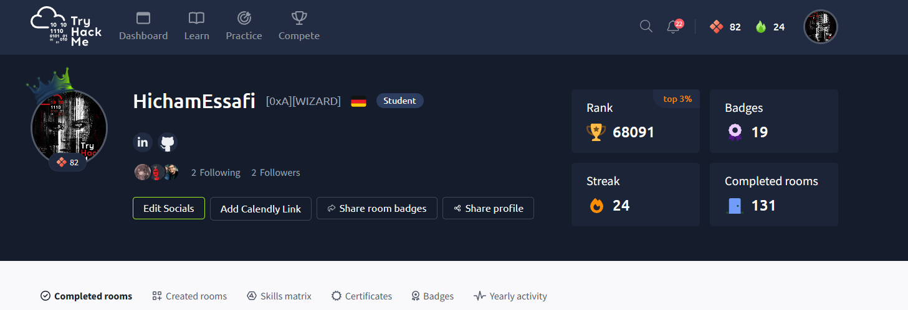

# Hicham Essafi

Cybersecurity graduate focused on junior SOC analyst and security-operations roles in Germany.

I use controlled labs to practice Windows security monitoring, Splunk and Microsoft Sentinel detection logic, KQL/SPL, phishing triage, incident documentation, and Wireshark analysis. My repositories separate observed lab evidence, synthetic scenario data, and unfinished work so that each claim can be reviewed directly.

## SOC Portfolio

| Project | Demonstrated work | Current evidence status |
|---|---|---|
| [SOC Analyst Lab](https://github.com/arriess/SOC-Analyst-Lab) | Windows Event IDs 4624, 4625, 4688, 4720, and 4732; Splunk detections; one Sentinel/KQL case; two analyst investigations; Wireshark DNS analysis | Four scheduled Splunk alerts are documented as validated. Detection 002 has a historical search match and a passing offline guard test; the corrected alert awaits live re-testing. The Sentinel result is documented without a screenshot. |
| [Phishing Analysis & Incident Response Lab](https://github.com/arriess/Phishing-Analysis-Lab) | Three controlled credential-phishing, suspicious-link, and BEC analyses; synthetic samples; IOC sets; response playbook; reproducible email and URL parsing | All three case artifacts are reproducible from committed samples and automatically checked. The scenarios remain explicitly synthetic. |
| [Threat Hunting & Detection Engineering Lab](https://github.com/arriess/Threat-Hunting-Detection-Lab) | Three threat hypotheses, seven labelled synthetic process events, positive and negative controls, Base64 decoding, and three Sigma drafts | Three offline fixture tests are reproducible and automatically checked. Live Splunk/Sentinel and Sigma-backend validation remain pending. |

## Technical Focus

**Security operations and investigation**

- Alert triage and incident-investigation fundamentals
- Windows Security Event analysis
- Authentication, account-creation, and privilege-change monitoring
- Phishing, BEC, email-header, URL, and IOC analysis
- MITRE ATT&CK mapping and false-positive assessment

**SIEM and detection**

- Splunk Enterprise and SPL
- Microsoft Sentinel and KQL
- Azure Arc, Azure Monitor Agent, Data Collection Rules, and `SecurityEvent`
- Scheduled-alert testing and detection documentation

**Network and systems**

- Wireshark and DNS analysis
- Windows and Linux
- PowerShell, Windows Command Prompt, and Python fundamentals
- VirtualBox lab environments

## Hands-on Learning and Training

**TryHackMe activity (8 September 2026):** 131 completed rooms, Top 3%, 19 badges, and a 24-day streak.

- Windows and Linux security labs
- Cisco cybersecurity, networking, and IoT training
- ISC2 Certified in Cybersecurity (CC) self-paced training
- TryHackMe CompTIA PenTest+ learning path completion

## Opportunities

I am seeking Junior SOC Analyst, Cybersecurity Analyst, Security Operations Analyst, and Junior Security Analyst opportunities in Germany.

## Profiles

- [LinkedIn](https://www.linkedin.com/in/hicham-essafi/)
- [TryHackMe](https://tryhackme.com/p/HichamEssafi)
- [Credly](https://www.credly.com/users/hicham-essafi)
